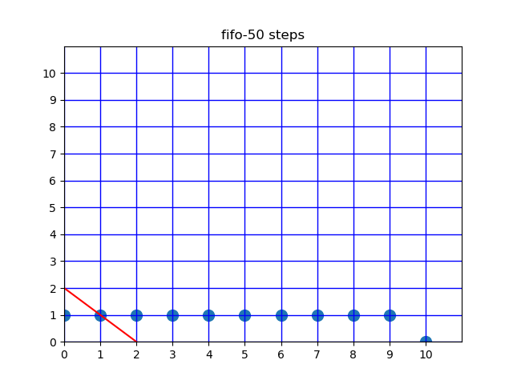
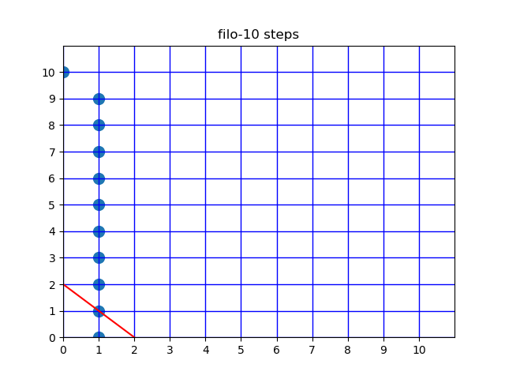
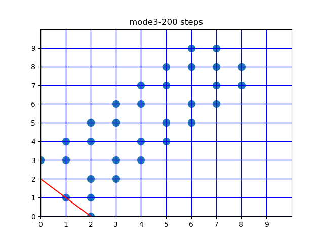

# simulation

I see this peoblem as a scheduling problem. The result heavily depends on the order the points are moved. 
Currently the code provides 3 schedulers: FIFO, FILO, and mode3.
The simulation results show the trend of having infinite steps, which indicates the goal is impossible to reach. 
However, there might exist a specific scheduler that could solve the problem.

If not, please add your formalized proof :)
